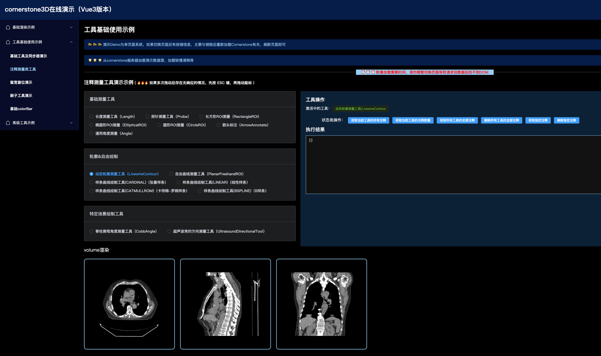
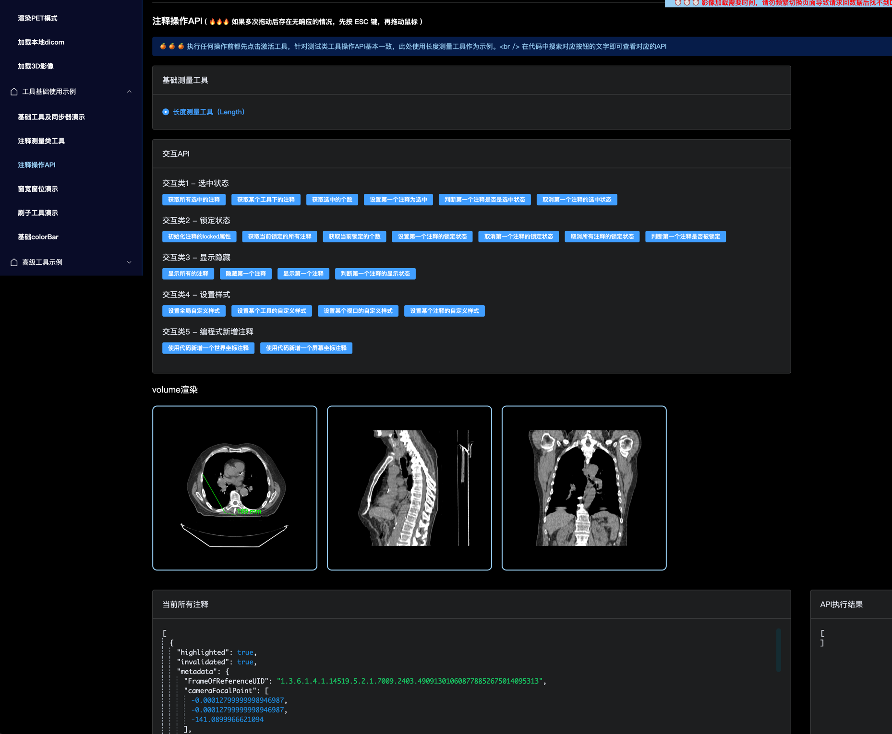

# Cornerstone 3D 演示案例（基于 Vue3 框架）

⛳️ 该仓库为从 0 开始上手 `Cornerstone3D` 的演示示例，从基础的影像渲染、工具运用，逐步延展至业务需求、自定义工具类等场景，直至源码解析环节。案例演示由易到难，循序渐进，对于刚刚开始接触 Cornerstone 的朋友极其友好。

🚀 目前 Vue 版本已由 2.6 升级至 Vue3，打包工具为 webpack，node 版本 20.17.0。项目中 webpack 的配置已解决部分新上手时问题，如果是使用 vite 打包可查看[vite 构建](https://juejin.cn/post/7390577262292746291)

🎉 🎉 🎉 仓库将持续更新，欢迎大家 Star，在使用过程中遇到任何相关问题或需要的功能示例欢迎随时 issues 或掘金博客中评论。

## 本地运行

1. clone 到本地 `git clone https://github.com/jianyaoo/vue-cornerstone-demo.git`

2. 更新 node 版本为 20 版本以上

3. 安装依赖 `yarn install`

4. 启动项目 `npm run serve`

## 已支持的功能

### 🎈 基础渲染示例

- [渲染栈影像](https://github.com/jianyaoo/vue-cornerstone-demo/blob/main/src/views/basicUsage/BaseStack.vue)
- [渲染 Volume 影像](https://github.com/jianyaoo/vue-cornerstone-demo/blob/main/src/views/basicUsage/BaseVolume.vue)
- [渲染 nifti 文件](https://github.com/jianyaoo/vue-cornerstone-demo/blob/main/src/views/basicUsage/BaseNiftyFile.vue)
- [渲染 PET 融合模式](https://github.com/jianyaoo/vue-cornerstone-demo/blob/main/src/views/basicUsage/BasicPET.vue)
- [加载本地 dicom](https://github.com/jianyaoo/vue-cornerstone-demo/blob/main/src/views/basicUsage/LocalFile.vue)
- [渲染 3D 影像](https://github.com/jianyaoo/vue-cornerstone-demo/blob/main/src/views/basicUsage/Basic3DRender.vue)

### 📡 工具基础使用示例

- [基础工具使用](https://github.com/jianyaoo/vue-cornerstone-demo/blob/main/src/views/basicTools/BasicToolUse.vue)
- [窗宽窗位演示](https://github.com/jianyaoo/vue-cornerstone-demo/blob/main/src/views/basicTools/WindowLevel.vue)
- [注释工具使用](https://github.com/jianyaoo/vue-cornerstone-demo/blob/main/src/views/basicTools/AnnotationTool.vue)
- [注释工具操作 API](https://github.com/jianyaoo/vue-cornerstone-demo/blob/main/src/views/basicTools/AnnotationOperator.vue)
- [刷子工具演示](https://github.com/jianyaoo/vue-cornerstone-demo/blob/main/src/views/basicTools/BasicSegmentation.vue)
- [基础 colorBar](https://github.com/jianyaoo/vue-cornerstone-demo/blob/main/src/views/basicTools/ColorBar.vue)

### 🪜 高级工具示例

- [高级 colorBar 示例](https://github.com/jianyaoo/vue-cornerstone-demo/blob/main/src/views/advancedUsage/ReconColorBar.vue)

## 博客

### 🌾 图解系列

- [一文(10 图)了解 Cornerstone3D 核心概念(万字总结附导图)](https://juejin.cn/post/7326432875955798027)
- [一文(N 长图)了解 Cornerstone3DTools 常用工具(万字总结附导图)](https://juejin.cn/post/7330300019022495779)

### 🌿 基础功能系列

- [如何渲染一个基础的 Dicom 文件](https://juejin.cn/post/7322754558275878924)
- [如何渲染一个 nifti 格式的文件](https://juejin.cn/post/7324886896214605878)
- [如何渲染一个 3D 影像](https://juejin.cn/post/7406150677225685031)
- [使用 Cornerstone 加载本地的 dicom 文件并渲染](https://juejin.cn/post/7393189744329719846)
- [Cornerstone 加载本地 Dicom 文件第二弹 - Blob 篇](https://juejin.cn/post/7399530649999654946)
- [Cornerstone 渲染 CT+PET 融合影像及相关应用场景](https://juejin.cn/post/7405250711283335206)
- [Cornerstone3D Tools 对影像进行交互(中篇)-注释类工具使用](https://juejin.cn/post/7425910507351228470)

### 🍒 工具应用系列

- [Cornerstone3D Tools 对影像进行交互(上篇)-基础交互工具及同步器](https://juejin.cn/post/7407644269995065384)

### 🌴 场景及原理解析系列

- [获取 Dicom 文件某点 CT 值的实践方案](https://juejin.cn/post/7320474963063259177)
- [一文了解 Cornerstone3D 中窗宽窗位的 3 种设置场景及原理](https://juejin.cn/post/7344881744245948453)

### 🍂 踩坑记录

- [Cornerstone3D 导致浏览器崩溃的踩坑记录](https://juejin.cn/post/7390480675172728882)
- [记录 vite 项目中 Cornerstone 的兼容问题](https://juejin.cn/post/7390577262292746291)

## 项目截图

### 渲染栈影像

### 渲染 volume 影像

### 渲染 PET 融合模式

### 基础工具使用

### 注释工具使用

### 注释工具操作 API

 测试测试
